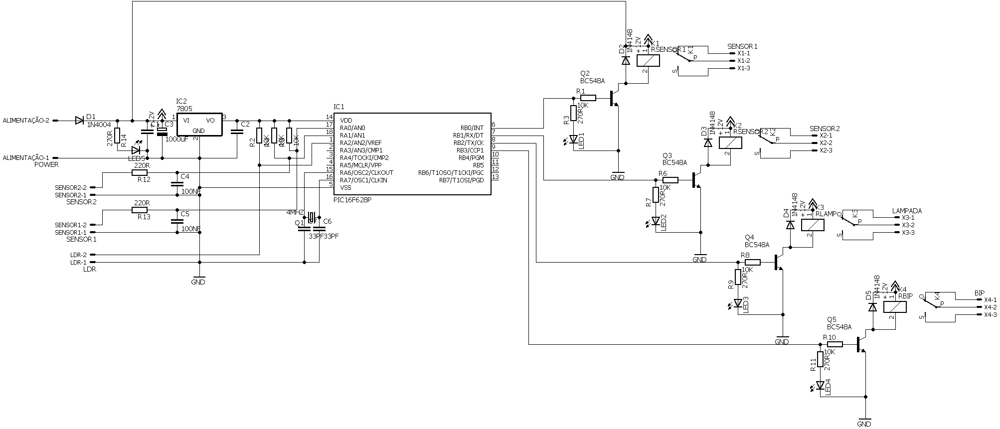
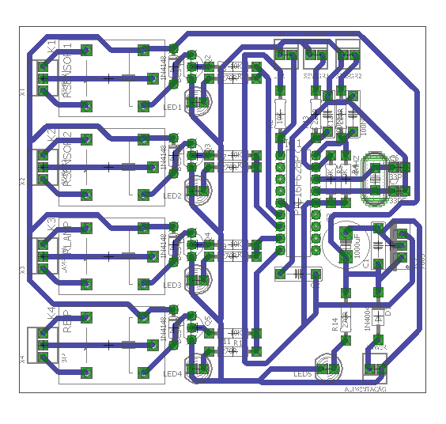

# Simulação do Proteus com microcontrolador PIC16F628A e código em Assembly

Este repositório contém arquivos de simulação do software Proteus da Labcenter Software para o microcontrolador PIC16F628A, juntamente com o código em assembly para o mesmo. Também está disponível um projeto no Cadsoft Eagle contendo a placa e o esquemático do circuito.

## Arquivos do Proteus

Os arquivos de simulação do Proteus estão localizados na pasta "Proteus Simulation". Esta pasta contém o arquivo "CIRCUITO CAMERAS.DSN", que é o arquivo de projeto do Proteus. Dentro do arquivo de projeto, há um esquemático do circuito e um arquivo de programa para o microcontrolador PIC16F628A.

## Código em Assembly

O código em assembly para o microcontrolador PIC16F628A está localizado na pasta "Assembly Code". Há um único arquivo nesta pasta, chamado "SENSOR PRESENÇA.asm", que contém o código em assembly completo para o microcontrolador.

## Projeto no Cadsoft Eagle

O projeto do Cadsoft Eagle está localizado na pasta "Eagle Project". Há dois arquivos nesta pasta: "SENSOR CAMERA 001.sch" e "SENSOR CAMERA 001.brd". O arquivo "SENSOR CAMERA 001.sch" contém o esquemático do circuito e o arquivo "SENSOR CAMERA 001.brd" contém o layout da placa.

### Esquemático do circuito

### Layout da placa

## Créditos

Este projeto foi criado por Alexandro Henrique Loch. Se você tiver alguma dúvida ou precisar de ajuda, sinta-se à vontade para entrar em contato comigo através do meu perfil do GitHub.